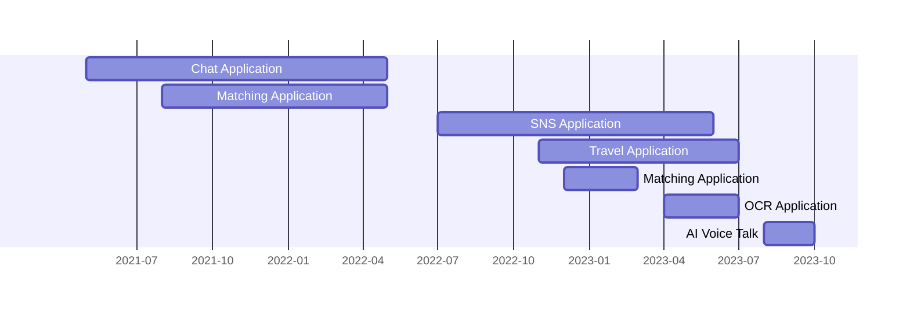

# Ryo Kuwano's Resume

## Contact Information

- Email: kuwanor0811@gmail.com
- Phone: +81-80-4637-0565
- Location: Tokushima Japan

---

## Social Media & Github

  

---

## Summary

Highly motivated software developer with a strong background in mobile and web application development. Experienced in working with various technology stacks and cloud services. Passionate about learning new technologies and contributing to team success.

---
## Skills

- Web page development in Next.js (1 Year)
- Mobile application development in React Native (1 Year)
- Mobile application development in Flutter (1 Year)
- Backend application development in Ruby on Rails (1 Year)
- Development using various Firebase features (2 Years)
- Personal app [AI Voice Talk](https://github.com/RYO1223/resume/blob/master/docs/AI_Voice_Talk.md) development from design to submission to Stores

---

## Technology Stacks

### Programming Languages

  
  
  
  

### FrontEnd Frameworks

  
  
  
  
  

### Backend Frameworks

  
  

### Cloud Services

  
  
  
  
  
  

  
  

  
  

  
  

### DevOps and Others

  
  
  
  
  
  
  

---

## Details of work history

### Chat Application Development (1 Year)

agile dev

- **Features I implemented：**

  - FrontEnd application development in React Native + Expo
  - Backend API development in Rails + Graphql
  - Test code writing using Rspec
  - Firebase Auth, Storage, Function

### Matching Application Development (9 Months)

agile dev

- **Features I implemented：**

  - Web page development in Next.js
  - Backend API development in Rails + Graphql
  - Test code writing using Rspec
  - Firebase Auth
  - Implementation of a function to fetch data via an external API and store it in a DB
  - Implementation of error detection tools
  - Implementation of email delivery tools
 
### SNS Application Development (11 Months)

- **Features I implemented：**

  - Mobile application development in Flutter
    - Implementation of real-time chat function using Firestore.
    - Implementation of FlutterWeb
  - Backend API development in Ruby on Rails
  - Firebase (Authentication, Storage, Firestore, Hosting, Function)
  - Deployment work and failure investigation on AWS EC2
 
### Travel Application Development (8 Months)

- **Features I implemented：**

  - Mobile application development in Flutter
    - Implement a rich　Japanese map using [CustomPainter](https://api.flutter.dev/flutter/rendering/CustomPainter-class.html).
    - Implementation of rich scrolling using [Sliver](https://docs.flutter.dev/ui/advanced/slivers)
    - Implementation of billing function using RevenueCat
    - Design and Implementation of core functions

### Matching Application Development (3 Months)

- **Features I implemented：**

  - Backend and admin page development in Ruby on Rails
    - Implementation of Push Notification function to Mobile
  
### OCR Application Development (3 Months)

- **Features I implemented：**

  -　Bug fix of core functions in Flutter

### [AI Voice Talk](https://github.com/RYO1223/resume/blob/master/docs/AI_Voice_Talk.md) (2 moths)

- **Features I implemented：**

  - All. For more information, click the link above.

---

## Willingness/Interest

- I am intensely interested in new fields and technologies and would like to learn more about new technologies!
- I am interested in large-scale team development. I am interested in how the team selects the architecture and technologies.
- I would like to participate in OSS and fix bugs.
- If there are exciting ideas, I would like to develop them.

---

## Desired Conditions

- I live in rural areas and would like to work remotely.
- I like the process of creating user-first products. As I am told, I would like to talk with you about functional requirements rather than just making them.
- I like to work in an environment where I can proactively tackle new challenges.

